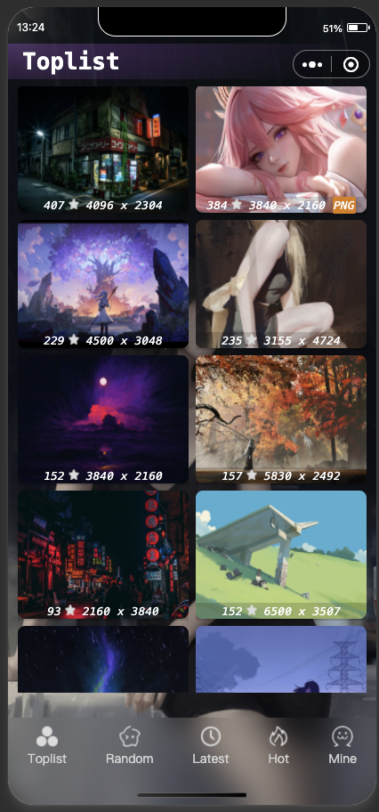

<h1 align="center">
    WALLHAVEN 
</h1>
<p align="center">
    The best wallpapers on the Net!
</p>

<div align="center">
    
</div>

# Overview
The Project is built with:
- [Vue.js](https://vuejs.org/)
- [Uno CSS](https://unocss.dev/)
- [Typescript](https://www.typescriptlang.org/)
- [uni-app](https://uniapp.dcloud.net.cn)
- [wallhaven](https://wallhaven.cc/)

# Quickstart

### Setting up the environment variables

Navigate into your projects directory and get your environment variables ready:

```shell
cd wallhaven/mp-wechat/
mv .env.template .env.local
```

### Install dependencies

Use pnpm to install all dependencies.

```shell
pnpm install
```

# Getting Started

First, run the development server:

```shell
cd wallhaven
pnpm dev:mp-wechat
# or
cd wallhaven/map-wechat
pnpm dev
```

Open [Weixin DevTools](https://developers.weixin.qq.com/miniprogram/en/dev/devtools/devtools.html) With Mini Program debugging, developers can debug the Mini Program APIs and pages, view and edit codes, preview and publish the Mini Program, etc.
